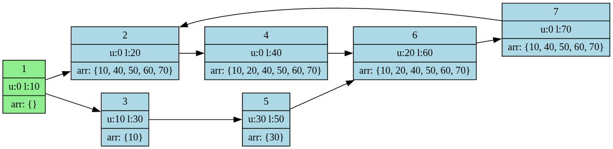

# RailFlow

A fixed-point dataflow analysis over a directed railway graph. Each station unloads one cargo type and loads another; a train carries a set of cargo labels (no quantities). Given a starting station (with an empty cargo set), the solver computes, for every station, the union of all cargo sets a train could be carrying upon arrival across all possible routes — including cycles.

This mirrors how compiler optimizations propagate information through SSA/IR graphs.

## Algorithm

Two solvers are provided, both implementing fixed-point iteration:

- **RpoSolver** (default) — processes nodes in reverse post-order (RPO), which converges faster on acyclic paths and handles back-edges via re-queuing.
- **BfsSolver** — worklist-based BFS; simpler but may require more iterations.

Both guarantee termination because cargo sets only grow (union) and the domain is finite.

## Input Format

```
S T
s c_unload c_load    (S lines)
s_from s_to          (T lines)
s_0
```

- `S` — number of stations, `T` — number of tracks
- Each station line: station id, cargo type to unload, cargo type to load (integers)
- Each track line: directed edge
- Last line: starting station id

## Output Format

```
station_id: [sorted list of cargo types present on arrival]
```

## Running

Requires JDK 21+.

```bash
# Build
./gradlew build

# Run (reads from stdin)
./gradlew run < example/input.txt

# Use BFS solver instead of RPO
./gradlew run --args="--bfs" < example/input.txt

# Export graph to output.dot (Graphviz)
./gradlew run --args="--dot" < example/input.txt
```

### Example input

```
7 8
1 0 10
2 0 20
3 10 30
4 0 40
5 30 50
6 20 60
7 0 70
1 2
1 3
2 4
3 5
4 6
5 6
6 7
7 2
1
```

### Example output

```
1: []
2: [10, 40, 50, 60, 70]
3: [10]
4: [10, 20, 40, 50, 60, 70]
5: [30]
6: [10, 20, 40, 50, 60, 70]
7: [10, 40, 50, 60, 70]
```

### Example output visualization (Graphviz)

